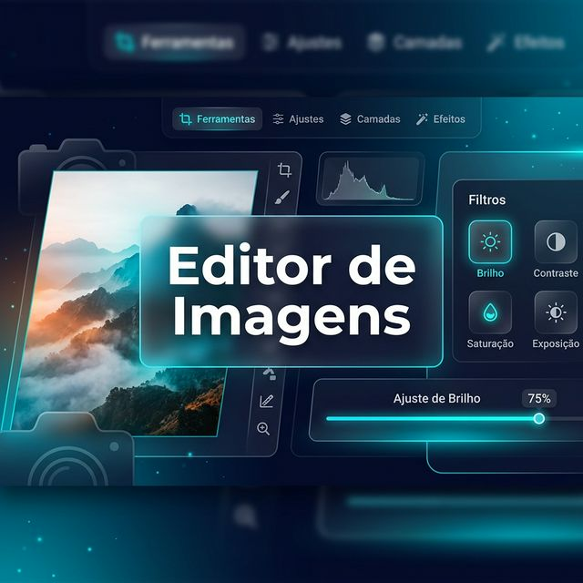
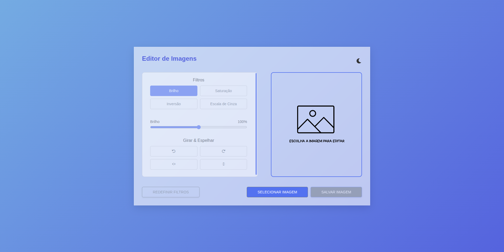
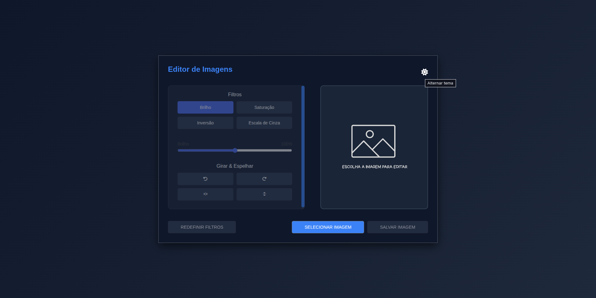

  <h1 align="center">
       Editor de Imagens
    <br />
    <br />
  <a href="https://github.com/StellaKarolinaNunes/Editor_de_Imagens">
    
  </a>
</div>

<p align="center">
  
  
  
  
  <a href="https://github.com/StellaKarolinaNunes/Editor_de_Imagens/blob/main/LICENSE">
    
  </a>
</p>

---

##  Introdução
**Editor de Imagens**  Este projeto foi desenvolvido durante o segundo semestre da faculdade como parte da disciplina Tópicos Especiais em Engenharia de Software 1. O objetivo era ampliar os conceitos de Padrões de projeto até a data, aplicando-os na criação de um editor de fotos em html,css e js

<br>

## Por que Editor de Imagens ?
A escolha deste projeto permitiu explorar a aplicação prática de conceitos de Engenharia de Software, especificamente Padrões de Projeto, em uma ferramenta funcional. Um editor de imagens exige uma gestão eficiente de estados e operações, proporcionando o cenário perfeito para exercitar a modularidade e a manutenibilidade do código utilizando tecnologias fundamentais da web.
  

## A Solução
O projeto consiste em um editor de imagens que permite realizar diversas operações, como:
- Brilho
- Saturação
- Inversão
- Escala de cinza
- Rotação
- Espelhamento

 ## Funcionalidades Principais

- Selecionar imagem
- Aplicar filtros
- Rotacionar imagem
- Espelhar imagem
- Redefinir filtros
- Salvar imagem

<br>

## Layout da Aplicação

<p align="center">
  
</p>
<p align="center">
  
</p>

> **Nota:**  
> Este projeto possui fins acadêmicos e pode ser adaptado conforme a necessidade.

<br>

##  Estrutura de Pastas

A estrutura do projeto segue o padrão de organização por camadas, facilitando a manutenção e escalabilidade.

```bash
Editor_de_Imagens/
├── assets/                    # Recursos estáticos
│   ├── css/                   # Estilos visuais (style.css)
│   ├── imagem/                # Imagens e ícones (imagem_padrao.svg)
│   └── javascript/            # Lógica do editor (main.js)
├── .gitignore                 # Arquivos ignorados pelo Git
├── index.html                 # Estrutura principal da página (HTML5)
├── LICENSE                    # Licença do projeto
└── README.md                  # Documentação do sistema
```

<br>

##  Instalação

### Pré-requisitos para Rodar Editor de Imagens na sua maquina 
*  1. **Navegador Web:** Uma versão atualizada do Google Chrome, Mozilla Firefox, Microsoft Edge ou Safari.
* 2. **Editor de Código (Opcional):** Recomendamos o [VS Code](https://code.visualstudio.com/) caso deseje visualizar ou modificar o código-fonte.
* 3. **Git:** Necessário para clonar o repositório em sua máquina local.

<br>

###  Instalação Rápida

####  1. Clone o repositório

```bash
git clone https://github.com/StellaKarolinaNunes/Editor_de_Imagens.git
```

####  2. Navegue até o diretório do projeto

```bash
cd Editor_de_Imagens
```

####  3. Abra o arquivo index.html no navegador

```bash
open index.html
```

<br>

##  Roadmap

O desenvolvimento do **Editor de Imagens** está focado em evoluir de uma ferramenta acadêmica para um editor web performático e rico em recursos. Abaixo estão as etapas planejadas:

### Fase 1: Expansão de Filtros e Ajustes (Curto Prazo)
- [ ] **Novos Filtros Strategy:** Implementar filtros de Sépia, Desfoque (Blur), Contraste e Matiz (Hue-Rotate).
- [ ] **Suporte a Múltiplos Formatos:** Permitir exportação em PNG e WebP com controle de qualidade.
- [ ] **Preview em Tempo Real Aprimorado:** Otimizar o render do canvas para imagens de alta resolução (4K+).

### Fase 2: Experiência do Usuário e Controle (Médio Prazo)
- [ ] **Sistema de Histórico (Undo/Redo):** Implementar o padrão **Command** para permitir desfazer e refazer ações.
- [ ] **Modo Responsivo (Mobile First):** Reestilizar a interface para garantir usabilidade em tablets e smartphones.
- [ ] **Galeria de Históricos de Sessão:** Salvar edições temporárias no `IndexedDB` para não perder o trabalho ao atualizar a página.

### Fase 3: Edição Avançada e Geometria (Longo Prazo)
- [ ] **Ferramenta de Recorte (Crop):** Adicionar funcionalidade de corte livre e proporções fixas (1:1, 16:9).
- [ ] **Texto e Formas:** Permitir a inserção de textos customizáveis e formas geométricas sobre a imagem.
- [ ] **Redimensionamento:** Ajuste manual de largura e altura mantendo a proporção.

### Fase 4: Ecossistema e Performance (Futuro)
- [ ] **PWA (Progressive Web App):** Transformar o editor em um app instalável com suporte offline total.
- [ ] **Processamento via Web Workers:** Mover o processamento pesado de filtros para threads separadas, evitando travamentos na UI.
- [ ] **Integração com Nuvem:** Opção de salvar diretamente no Google Drive ou Dropbox.

---

##  Contribuição

Contribuições são fundamentais para a evolução deste projeto! Se você deseja colaborar, siga as diretrizes abaixo para garantir um processo de integração suave e profissional.

### Fluxo de Contribuição
1. **Fork do Repositório**: Crie uma cópia do projeto em sua conta GitHub.
2. **Clonagem Local**: Clone o seu fork para sua máquina de desenvolvimento.
3. **Criação de Branch**: Crie uma branch específica para sua melhoria: `git checkout -b feature/sua-funcionalidade`.
4. **Desenvolvimento e Commits**: Implemente as mudanças seguindo os padrões do projeto e realize commits claros.
5. **Testes**: Certifique-se de que todas as funcionalidades operam corretamente.
6. **Pull Request**: Abra um PR detalhando o que foi alterado e o porquê.

### Boas Práticas
- **Padrões de Código**: Mantenha a consistência com o uso do **Strategy Pattern**.
- **Mensagens de Commit**: Utilize mensagens objetivas.
- **Interface**: Respeite a paleta de cores e o design system definido no CSS.

<br>

##  Créditos
O **Editor de Imagens** foi desenvolvido com foco técnico e acadêmico, utilizando as melhores práticas de Engenharia de Software:

- **Linguagens:** HTML5, CSS3 e JavaScript ES6+
- **Arquitetura:** Strategy Pattern para gerenciamento de filtros.
- **Bibliotecas de Teoria:** [Boxicons](https://boxicons.com/) & [Font Awesome](https://fontawesome.com/).
- **Tipografia:** Urbanist (Google Fonts).

<br>

### Equipe de Desenvolvimento

<table align="center">
  <tr>
    <td align="center">
      <a href="https://github.com/StellaKarolinaNunes">
        
        <br>
        <sub><b>Stella Karolina</b></sub>
        <br>
        <sub>Desenvolvedora</sub>
      </a>
    </td>
  </tr>
</table>

<br>

> Projeto acadêmico IFPA | Ciência da Computação – Editor de Imagens em HTML, CSS e JS para aprendizado.